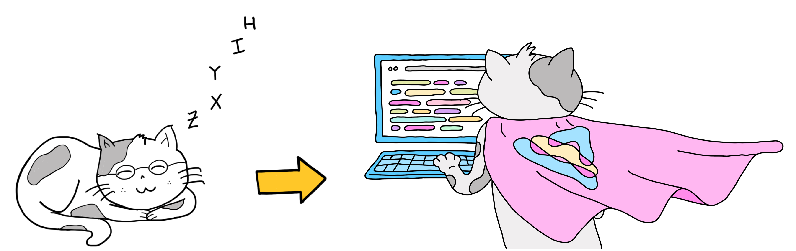

# [WIP]

**Hello world**, this is my first Jekyll blog post.

{: width="75%"}

<!-- 
 -->

> Here I will write about my meta experience when collaborating do the blog post [From Zero to Open Source](https://pennylane.ai/blog/2023/10/from_zero_to_open_source-contributing_to_quantum_software_projects/) which was released last week (October 2023).